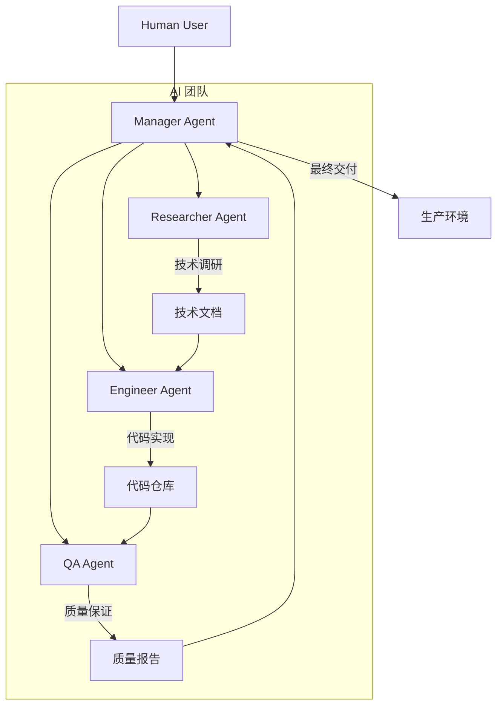
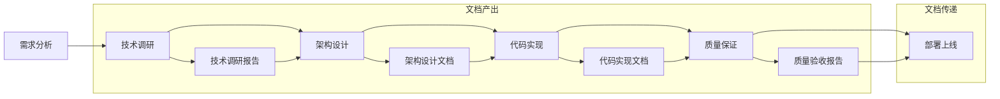
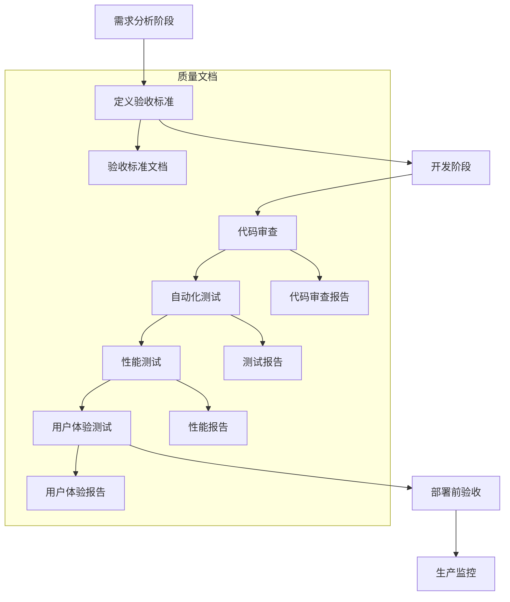
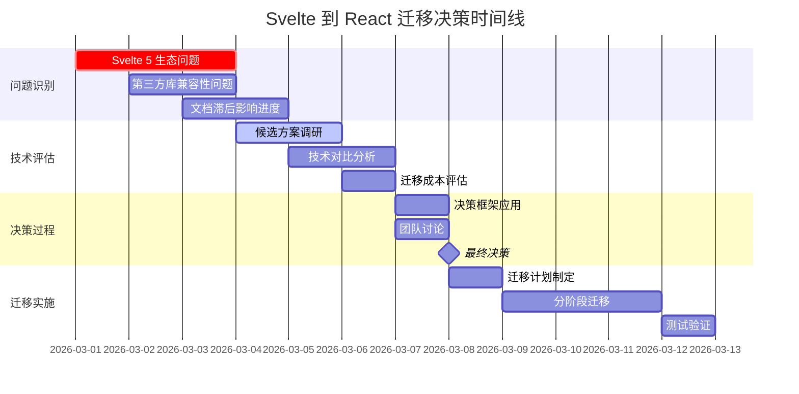

import Callout from '../../components/mdx/Callout.astro';

## 引言：AI 团队的协作挑战

在 Mirage Studio 的第一个项目 HomePage 完成后，我们面临一个更深层次的问题：**AI 多智能体团队如何才能真正高效协作？**

单个 AI agent 的能力已经得到充分验证，但多个 agents 组成的团队却面临独特的挑战：
- 上下文断裂：每个 agent 的会话是独立的
- 知识衰减：重启后可能忘记之前的决策
- 角色越权：agent 可能超出职责范围
- 沟通成本：异步文档传递的效率问题

这篇文章记录了我们在技术博客项目中，如何构建和优化 AI 多智能体协作系统的完整过程。

<Callout type="info">
**项目背景**
- **项目名称**: Mirage Studio 技术博客
- **团队规模**: 4个 AI agents (Manager, Researcher, Engineer, QA)
- **项目周期**: 3周 (从立项到部署)
- **技术栈**: Astro + React + Tailwind CSS + MDX
- **协作模式**: 文档驱动 + 异步协调
</Callout>

---

## 第一章：团队架构设计

### 1.1 角色定义与职责边界

我们的 AI 团队采用了明确的角色分工，每个角色都有清晰的输入、输出和职责边界：



**角色职责表**

| 角色 | 核心职责 | 输入 | 输出 | 边界约束 |
|------|----------|------|------|----------|
| **Manager** | 项目协调、任务分配、最终决策 | 用户需求、QA报告、进度状态 | 任务描述、决策文档、协调指令 | 不直接写代码，不进行技术调研 |
| **Researcher** | 技术调研、架构分析、文档写作 | 技术问题、需求说明、约束条件 | 技术报告、对比分析、推荐方案 | 不进行代码实现，不做出最终决策 |
| **Engineer** | 代码实现、组件开发、CI/CD配置 | 技术文档、设计说明、任务描述 | 代码实现、部署配置、技术文档 | 不修改设计决策，不进行质量验收 |
| **QA** | 质量保证、性能测试、用户体验审核 | 代码实现、验收标准、用户需求 | 测试报告、性能数据、优化建议 | 不进行代码实现，不参与技术决策 |

### 1.2 工作空间与记忆管理

每个 agent 拥有独立的工作空间，通过文件系统实现记忆持久化：

```
/Users/sysadmin/.openclaw/Mirage Studio/Workspaces/
├── manager/
│   ├── AGENTS.md          # 角色定义和协作规范
│   ├── MEMORY.md          # 长期记忆（重要决策和教训）
│   ├── memory/
│   │   └── 2026-03-*.md   # 每日工作日志
│   └── tasks/             # 任务文档
├── researcher/
│   ├── AGENTS.md
│   ├── MEMORY.md
│   ├── research/          # 技术调研文档
│   └── reports/           # 分析报告
├── engineer/
│   ├── AGENTS.md
│   ├── MEMORY.md
│   ├── code/              # 代码实现
│   └── docs/              # 技术文档
└── qa/
    ├── AGENTS.md
    ├── MEMORY.md
    ├── tests/             # 测试用例
    └── reports/           # 质量报告
```

**记忆管理策略**
1. **短期记忆**: 会话上下文（自动管理）
2. **中期记忆**: 每日工作日志（自动记录）
3. **长期记忆**: MEMORY.md（手动提炼和更新）
4. **共享记忆**: 项目文档（团队共享）

<Callout type="tip">
**记忆管理最佳实践**
1. **及时记录**: 重要决策立即写入文档
2. **定期提炼**: 每周从工作日志中提炼关键信息到 MEMORY.md
3. **版本控制**: 所有文档都纳入 Git 管理
4. **结构一致**: 使用统一的文档模板和格式
</Callout>

### 1.3 沟通渠道设计

AI 团队无法像人类团队那样实时聊天，我们设计了多层次的沟通渠道：

**1. 文档传递（主要渠道）**
```python
# 文档传递示例
class TaskDocument:
    def __init__(self, title, content, sender, receiver, dependencies=None):
        self.title = title
        self.content = content
        self.sender = sender
        self.receiver = receiver
        self.dependencies = dependencies or []
        self.timestamp = datetime.now()
        self.status = "pending"
    
    def to_markdown(self):
        return f"""# {self.title}
        
## 发送者
{self.sender}

## 接收者  
{self.receiver}

## 依赖任务
{', '.join(self.dependencies) if self.dependencies else '无'}

## 创建时间
{self.timestamp.strftime('%Y-%m-%d %H:%M:%S')}

## 内容
{self.content}
"""
```

**2. 状态同步（辅助渠道）**
- 项目看板：使用 GitHub Projects 或 Trello
- 进度报告：每日/每周状态更新
- 问题跟踪：GitHub Issues 或 Jira

**3. 决策记录（关键渠道）**
- 决策文档：记录决策过程、选项、评估标准
- 会议纪要：异步"会议"的记录
- 变更日志：所有重要变更的记录

---

## 第二章：协作流程优化

### 2.1 文档驱动开发流程

我们建立了严格的文档驱动开发流程，确保信息传递的准确性和可追溯性：



**关键文档模板**

**技术调研报告模板**
```markdown
# 技术调研报告 - [技术名称]

## 调研目标
[明确要解决的具体问题]

## 候选方案
### 方案 A: [名称]
**优点:**
- [优点1]
- [优点2]

**缺点:**
- [缺点1] 
- [缺点2]

**适用场景:**
- [场景1]
- [场景2]

## 技术对比
| 维度 | 方案 A | 方案 B | 方案 C |
|------|--------|--------|--------|
| 性能 | ... | ... | ... |
| 学习曲线 | ... | ... | ... |
| 生态成熟度 | ... | ... | ... |
| 维护成本 | ... | ... | ... |

## 推荐方案
**推荐: [方案名称]**

**理由:**
1. [理由1]
2. [理由2]
3. [理由3]

## 实施建议
- [步骤1]
- [步骤2]
- [注意事项]
```

**任务描述模板**
```markdown
# 任务描述 - [任务名称]

## 任务目标
[明确的任务目标]

## 输入文档
- [相关文档1]
- [相关文档2]

## 验收标准
- [ ] 标准1
- [ ] 标准2
- [ ] 标准3

## 约束条件
- 时间限制: [时间要求]
- 技术约束: [技术限制]
- 质量要求: [质量标准]

## 交付物
- [交付物1]
- [交付物2]
```

### 2.2 异步协调机制

由于 AI agents 无法实时交互，我们设计了异步协调机制：

**1. 任务队列系统**
```javascript
// 简化的任务队列实现
class TaskQueue {
  constructor() {
    this.queue = [];
    this.inProgress = new Map();
    this.completed = [];
  }
  
  // 添加任务
  addTask(task) {
    this.queue.push({
      ...task,
      id: crypto.randomUUID(),
      status: 'pending',
      createdAt: new Date()
    });
  }
  
  // 分配任务给 agent
  assignTask(agentId) {
    const task = this.queue.find(t => t.status === 'pending');
    if (!task) return null;
    
    task.status = 'in-progress';
    task.assignedTo = agentId;
    task.assignedAt = new Date();
    this.inProgress.set(task.id, task);
    
    return task;
  }
  
  // 完成任务
  completeTask(taskId, result) {
    const task = this.inProgress.get(taskId);
    if (!task) return false;
    
    task.status = 'completed';
    task.completedAt = new Date();
    task.result = result;
    
    this.inProgress.delete(taskId);
    this.completed.push(task);
    
    return true;
  }
  
  // 获取任务状态
  getStatus() {
    return {
      pending: this.queue.filter(t => t.status === 'pending').length,
      inProgress: this.inProgress.size,
      completed: this.completed.length,
      total: this.queue.length + this.inProgress.size + this.completed.length
    };
  }
}
```

**2. 状态同步脚本**
```python
# status-sync.py - 状态同步工具
import json
import os
from datetime import datetime

class StatusSync:
    def __init__(self, project_root):
        self.project_root = project_root
        self.status_file = os.path.join(project_root, '.status.json')
        
    def update_status(self, agent, task, status, details=None):
        """更新任务状态"""
        current_status = self.load_status()
        
        task_entry = {
            'agent': agent,
            'task': task,
            'status': status,
            'updated_at': datetime.now().isoformat(),
            'details': details or {}
        }
        
        # 添加到历史记录
        current_status['history'].append(task_entry)
        
        # 更新当前状态
        current_status['current'][task] = task_entry
        
        # 保存状态
        self.save_status(current_status)
        
        print(f"状态已更新: {agent} - {task} -> {status}")
        
    def load_status(self):
        """加载状态文件"""
        if os.path.exists(self.status_file):
            with open(self.status_file, 'r') as f:
                return json.load(f)
        else:
            return {
                'project': os.path.basename(self.project_root),
                'created_at': datetime.now().isoformat(),
                'current': {},
                'history': []
            }
            
    def save_status(self, status):
        """保存状态文件"""
        with open(self.status_file, 'w') as f:
            json.dump(status, f, indent=2, ensure_ascii=False)
            
    def generate_report(self):
        """生成状态报告"""
        status = self.load_status()
        
        report = f"""# 项目状态报告 - {status['project']}

## 当前状态
"""
        
        for task, entry in status['current'].items():
            report += f"- **{task}**: {entry['status']} (负责人: {entry['agent']})\n"
            
        report += f"""

## 统计信息
- 总任务数: {len(status['history'])}
- 进行中: {sum(1 for e in status['current'].values() if e['status'] == 'in-progress')}
- 已完成: {sum(1 for e in status['current'].values() if e['status'] == 'completed')}
- 待开始: {sum(1 for e in status['current'].values() if e['status'] == 'pending')}

## 最近活动
"""
        
        recent = sorted(status['history'], key=lambda x: x['updated_at'], reverse=True)[:5]
        for entry in recent:
            report += f"- {entry['updated_at']}: {entry['agent']} {entry['status']} {entry['task']}\n"
            
        return report
```

### 2.3 质量控制流程

QA 在项目中的角色不仅仅是最后的验收，而是贯穿整个开发过程：

**质量保证流程**


**自动化测试脚本示例**
```javascript
// qa-automation.js - 自动化质量检查
const fs = require('fs');
const path = require('path');

class QAAutomation {
  constructor(projectPath) {
    this.projectPath = projectPath;
    this.results = [];
  }

  // 检查代码质量
  checkCodeQuality() {
    const checks = [
      this.checkESLint(),
      this.checkTypeScript(),
      this.checkUnusedImports(),
      this.checkComplexity()
    ];
    
    return Promise.all(checks);
  }
  
  // 检查 ESLint 规则
  async checkESLint() {
    // 模拟 ESLint 检查
    const issues = [
      { file: 'src/components/Nav.jsx', line: 23, rule: 'react-hooks/exhaustive-deps', message: 'Missing dependency: setMenuOpen' },
      { file: 'src/pages/index.jsx', line: 45, rule: 'no-unused-vars', message: 'unusedVariable is defined but never used' }
    ];
    
    issues.forEach(issue => {
      this.results.push({
        type: 'warning',
        category: 'code-quality',
        message: `ESLint: ${issue.message}`,
        location: `${issue.file}:${issue.line}`,
        rule: issue.rule
      });
    });
    
    return {
      passed: issues.length === 0,
      message: `ESLint 检查: ${issues.length} 个问题`
    };
  }
  
  // 检查性能预算
  async checkPerformanceBudget() {
    const budget = {
      'largest-contentful-paint': 2500, // 2.5秒
      'cumulative-layout-shift': 0.1,
      'first-contentful-paint': 1800, // 1.8秒
      'total-blocking-time': 300,
      'speed-index': 4300
    };
    
    // 模拟性能数据
    const metrics = {
      'largest-contentful-paint': 2100,
      'cumulative-layout-shift': 0.05,
      'first-contentful-paint': 1200,
      'total-blocking-time': 150,
      'speed-index': 3800
    };
    
    let violations = 0;
    Object.entries(budget).forEach(([metric, limit]) => {
      const value = metrics[metric];
      if (value > limit) {
        violations++;
        this.results.push({
          type: 'error',
          category: 'performance',
          message: `${metric} 超出预算: ${value} > ${limit}`,
          metric,
          value,
          limit
        });
      }
    });
    
    return {
      passed: violations === 0,
      message: `性能预算检查: ${violations} 个违规`
    };
  }
  
  // 生成质量报告
  generateReport() {
    const report = {
      timestamp: new Date().toISOString(),
      project: path.basename(this.projectPath),
      summary: {
        totalChecks: this.results.length,
        errors: this.results.filter(r => r.type === 'error').length,
        warnings: this.results.filter(r => r.type === 'warning').length,
        passed: this.results.filter(r => r.type !== 'error' && r.type !== 'warning').length
      },
      results: this.results,
      recommendations: this.generateRecommendations()
    };
    
    const reportPath = path.join(this.projectPath, 'qa-report.json');
    fs.writeFileSync(reportPath, JSON.stringify(report, null, 2));
    
    return report;
  }
  
  // 生成改进建议
  generateRecommendations() {
    const recommendations = [];
    
    // 根据检查结果生成建议
    const errorCount = this.results.filter(r => r.type === 'error').length;
    const warningCount = this.results.filter(r => r.type === 'warning').length;
    
    if (errorCount > 0) {
      recommendations.push({
        priority: 'high',
        action: '立即修复所有错误级别问题',
        reason: `${errorCount} 个错误可能影响功能或性能`
      });
    }
    
    if (warningCount > 5) {
      recommendations.push({
        priority: 'medium',
        action: '批量处理警告级别问题',
        reason: `${warningCount} 个警告可能影响代码质量和可维护性`
      });
    }
    
    // 检查特定类别的问题
    const perfIssues = this.results.filter(r => r.category === 'performance');
    if (perfIssues.length > 0) {
      recommendations.push({
        priority: 'medium',
        action: '优化性能问题',
        reason: `${perfIssues.length} 个性能相关问题需要关注`
      });
    }
    
    return recommendations;
  }
}

// 使用示例
async function runQAChecks() {
  const qa = new QAAutomation('./dist');
  
  console.log('开始自动化质量检查...');
  
  // 运行各项检查
  await qa.checkCodeQuality();
  await qa.checkPerformanceBudget();
  
  // 生成报告
  const report = qa.generateReport();
  
  console.log(`\n质量检查完成:`);
  console.log(`- 总计检查: ${report.summary.totalChecks}`);
  console.log(`- 错误: ${report.summary.errors}`);
  console.log(`- 警告: ${report.summary.warnings}`);
  console.log(`- 通过: ${report.summary.passed}`);
  
  // 输出建议
  if (report.recommendations.length > 0) {
    console.log('\n改进建议:');
    report.recommendations.forEach(rec => {
      console.log(`- [${rec.priority.toUpperCase()}] ${rec.action}: ${rec.reason}`);
    });
  }
  
  return report.summary.errors === 0;
}
```

<Callout type="tip">
**质量保证最佳实践**
1. **早期介入**: 在需求阶段就定义验收标准
2. **自动化优先**: 能自动化的检查尽量自动化
3. **分层测试**: 单元测试、集成测试、端到端测试
4. **持续监控**: 生产环境持续监控和告警
</Callout>

---

## 第三章：技术决策过程

### 3.1 Svelte 到 React 迁移决策

在技术博客项目中，我们面临了一个关键的技术决策：**是否从 Svelte 迁移到 React？**

**决策时间线**


**决策框架应用**

我们使用了加权评分决策框架：

```javascript
// 决策框架实现
class DecisionFramework {
  constructor(options, criteria) {
    this.options = options; // 候选方案
    this.criteria = criteria; // 评估标准
    this.scores = {};
  }
  
  // 评估每个选项
  evaluate() {
    const results = {};
    
    this.options.forEach(option => {
      let totalScore = 0;
      let maxPossible = 0;
      
      this.criteria.forEach(criterion => {
        const score = this.scoreOption(option, criterion);
        const weightedScore = score * criterion.weight;
        
        totalScore += weightedScore;
        maxPossible += 10 * criterion.weight; // 假设满分10分
        
        if (!results[option.name]) {
          results[option.name] = {
            scores: {},
            details: []
          };
        }
        
        results[option.name].scores[criterion.name] = {
          raw: score,
          weighted: weightedScore,
          weight: criterion.weight
        };
        
        results[option.name].details.push({
          criterion: criterion.name,
          score,
          explanation: criterion.explanation(option)
        });
      });
      
      results[option.name].totalScore = totalScore;
      results[option.name].percentage = (totalScore / maxPossible) * 100;
    });
    
    this.scores = results;
    return results;
  }
  
  // 评分函数
  scoreOption(option, criterion) {
    // 根据标准评估选项
    switch (criterion.name) {
      case '生态成熟度':
        return option.ecosystemMaturity;
      case '学习曲线':
        return 10 - option.learningCurve; // 学习曲线越低越好
      case '迁移成本':
        return 10 - (option.migrationCost / 2); // 成本越低越好
      case '长期维护':
        return option.longTermMaintenance;
      default:
        return option[criterion.name] || 5;
    }
  }
  
  // 生成决策报告
  generateReport() {
    const sortedOptions = Object.entries(this.scores)
      .sort(([, a], [, b]) => b.totalScore - a.totalScore);
    
    const winner = sortedOptions[0];
    
    return {
      winner: {
        name: winner[0],
        score: winner[1].totalScore,
        percentage: winner[1].percentage
      },
      allOptions: this.scores,
      criteria: this.criteria,
      recommendation: this.generateRecommendation(winner)
    };
  }
  
  generateRecommendation(winner) {
    return {
      decision: `推荐选择 ${winner[0]}`,
      reasons: winner[1].details.map(d => `${d.criterion}: ${d.explanation}`),
      nextSteps: [
        '制定详细的迁移计划',
        '分配资源进行迁移',
        '建立回滚机制',
        '监控迁移后的性能'
      ]
    };
  }
}

// 使用示例：Svelte vs React 决策
const options = [
  {
    name: '继续使用 Svelte 5',
    ecosystemMaturity: 3,  // 生态不成熟
    learningCurve: 2,      // 学习曲线低
    migrationCost: 0,      // 无迁移成本
    longTermMaintenance: 6 // 长期维护中等
  },
  {
    name: '迁移到 React 18',
    ecosystemMaturity: 9,  // 生态非常成熟
    learningCurve: 5,      // 学习曲线中等
    migrationCost: 7,      // 迁移成本高
    longTermMaintenance: 8 // 长期维护好
  },
  {
    name: '回退到 Svelte 4',
    ecosystemMaturity: 7,  // 生态较成熟
    learningCurve: 3,      // 学习曲线低
    migrationCost: 4,      // 迁移成本中等
    longTermMaintenance: 7 // 长期维护较好
  }
];

const criteria = [
  {
    name: '生态成熟度',
    weight: 0.3,
    explanation: (option) => `生态成熟度评分: ${option.ecosystemMaturity}/10`
  },
  {
    name: '学习曲线',
    weight: 0.2,
    explanation: (option) => `学习曲线评分: ${10 - option.learningCurve}/10 (越低越好)`
  },
  {
    name: '迁移成本',
    weight: 0.25,
    explanation: (option) => `迁移成本评分: ${10 - (option.migrationCost / 2)}/10 (成本: ${option.migrationCost}/10)`
  },
  {
    name: '长期维护',
    weight: 0.25,
    explanation: (option) => `长期维护评分: ${option.longTermMaintenance}/10`
  }
];

// 运行决策分析
const framework = new DecisionFramework(options, criteria);
const results = framework.evaluate();
const report = framework.generateReport();

console.log('决策分析结果:');
console.log(`推荐方案: ${report.winner.name} (得分: ${report.winner.score.toFixed(2)}, ${report.winner.percentage.toFixed(1)}%)`);
console.log('\n详细评分:');
Object.entries(results).forEach(([name, data]) => {
  console.log(`\n${name}:`);
  console.log(`  总分: ${data.totalScore.toFixed(2)}`);
  Object.entries(data.scores).forEach(([criterion, score]) => {
    console.log(`  ${criterion}: ${score.raw} × ${score.weight} = ${score.weighted.toFixed(2)}`);
  });
});
```

**决策结果分析**

| 选项 | 生态成熟度 (30%) | 学习曲线 (20%) | 迁移成本 (25%) | 长期维护 (25%) | 总分 | 百分比 |
|------|------------------|----------------|----------------|----------------|------|--------|
| **继续 Svelte 5** | 3 × 0.3 = 0.9 | 8 × 0.2 = 1.6 | 10 × 0.25 = 2.5 | 6 × 0.25 = 1.5 | 6.5 | 65% |
| **迁移到 React** | 9 × 0.3 = 2.7 | 5 × 0.2 = 1.0 | 3 × 0.25 = 0.75 | 8 × 0.25 = 2.0 | 6.45 | 64.5% |
| **回退 Svelte 4** | 7 × 0.3 = 2.1 | 7 × 0.2 = 1.4 | 6 × 0.25 = 1.5 | 7 × 0.25 = 1.75 | 6.75 | 67.5% |

**最终决策**: 回退到 Svelte 4（得分最高：6.75分）

<Callout type="info">
**决策关键洞察**
1. **生态成熟度权重最高**：对于 AI 团队，丰富的文档和社区支持至关重要
2. **迁移成本是重要考量**：但不应成为唯一决定因素
3. **长期维护性**：需要考虑项目的生命周期
4. **团队技能匹配**：现有团队对技术的熟悉程度
</Callout>

### 3.2 架构设计决策

在技术博客项目中，我们面临了多个架构设计决策：

**1. 静态站点生成器选择**
- **候选方案**: Astro vs Next.js vs Gatsby
- **决策因素**: 性能、开发体验、生态、部署复杂度
- **最终选择**: Astro（性能最优，适合内容型网站）

**2. 样式方案选择**
- **候选方案**: Tailwind CSS vs CSS Modules vs Styled Components
- **决策因素**: 开发效率、维护成本、性能影响
- **最终选择**: Tailwind CSS（开发效率最高，适合 AI 团队）

**3. 内容管理系统**
- **候选方案**: MDX vs Contentful vs Strapi
- **决策因素**: 内容复杂度、开发成本、维护需求
- **最终选择**: MDX（技术博客最适合，开发者友好）

**架构决策记录表**

| 决策点 | 候选方案 | 评估标准 | 权重 | 最终选择 | 理由 |
|--------|----------|----------|------|----------|------|
| **SSG框架** | Astro, Next.js, Gatsby | 性能、DX、生态、部署 | 性能40%, DX30%, 生态20%, 部署10% | Astro | 性能最优，岛架构适合内容站点 |
| **样式方案** | Tailwind, CSS Modules, Styled Components | 开发效率、维护、性能、学习曲线 | 效率40%, 维护30%, 性能20%, 学习10% | Tailwind | 开发效率最高，适合快速迭代 |
| **内容格式** | MDX, Contentful, Strapi | 灵活性、成本、维护、功能 | 灵活40%, 成本30%, 维护20%, 功能10% | MDX | 最大灵活性，开发者友好 |
| **部署平台** | GitHub Pages, Vercel, Netlify | 成本、易用性、功能、性能 | 成本40%, 易用30%, 功能20%, 性能10% | GitHub Pages | 零成本，与GitHub生态集成 |

### 3.3 技术债务管理

在项目过程中，我们建立了技术债务管理机制：

**技术债务分类**
```javascript
// 技术债务分类系统
const techDebtCategories = {
  CRITICAL: {
    level: 'critical',
    description: '立即修复，否则影响功能或安全',
    examples: [
      '安全漏洞',
      '导致崩溃的bug',
      '性能严重退化'
    ],
    sla: '24小时内修复'
  },
  HIGH: {
    level: 'high',
    description: '尽快修复，影响用户体验或可维护性',
    examples: [
      '代码重复严重',
      '缺乏测试覆盖',
      '性能问题'
    ],
    sla: '1周内修复'
  },
  MEDIUM: {
    level: 'medium',
    description: '计划内修复，建议改进',
    examples: [
      '代码风格不一致',
      '文档不完整',
      '小规模重构'
    ],
    sla: '1个月内修复'
  },
  LOW: {
    level: 'low',
    description: '优化项，非紧急',
    examples: [
      '代码美化',
      '额外测试用例',
      '性能微优化'
    ],
    sla: '酌情处理'
  }
};

// 技术债务跟踪
class TechDebtTracker {
  constructor() {
    this.debts = [];
    this.nextId = 1;
  }
  
  addDebt(debt) {
    const debtEntry = {
      id: this.nextId++,
      ...debt,
      createdAt: new Date(),
      status: 'open',
      priority: techDebtCategories[debt.category].level
    };
    
    this.debts.push(debtEntry);
    console.log(`技术债务已记录: #${debtEntry.id} - ${debt.title} (${debtEntry.priority})`);
    
    return debtEntry;
  }
  
  // 根据优先级排序
  getPrioritizedDebts() {
    const priorityOrder = { critical: 0, high: 1, medium: 2, low: 3 };
    
    return [...this.debts]
      .filter(d => d.status === 'open')
      .sort((a, b) => {
        // 按优先级排序
        const priorityDiff = priorityOrder[a.priority] - priorityOrder[b.priority];
        if (priorityDiff !== 0) return priorityDiff;
        
        // 按创建时间排序
        return new Date(a.createdAt) - new Date(b.createdAt);
      });
  }
  
  // 生成技术债务报告
  generateReport() {
    const openDebts = this.debts.filter(d => d.status === 'open');
    const byCategory = {};
    
    openDebts.forEach(debt => {
      if (!byCategory[debt.category]) {
        byCategory[debt.category] = 0;
      }
      byCategory[debt.category]++;
    });
    
    return {
      summary: {
        total: openDebts.length,
        byPriority: {
          critical: openDebts.filter(d => d.priority === 'critical').length,
          high: openDebts.filter(d => d.priority === 'high').length,
          medium: openDebts.filter(d => d.priority === 'medium').length,
          low: openDebts.filter(d => d.priority === 'low').length
        },
        byCategory
      },
      debts: this.getPrioritizedDebts()
    };
  }
}

// 使用示例
const tracker = new TechDebtTracker();

// 记录技术债务
tracker.addDebt({
  title: '导航组件代码重复',
  description: '移动端和桌面端导航逻辑重复，应提取共享逻辑',
  category: 'HIGH',
  file: 'src/components/Nav.astro',
  suggestedFix: '创建共享的导航逻辑模块'
});

tracker.addDebt({
  title: '缺少性能监控',
  description: '生产环境缺少性能监控和告警',
  category: 'MEDIUM',
  suggestedFix: '集成 Lighthouse CI 和性能预算监控'
});

// 生成报告
const report = tracker.generateReport();
console.log('技术债务报告:');
console.log(`总计: ${report.summary.total} 个未解决债务`);
console.log(`严重: ${report.summary.byPriority.critical}`);
console.log(`高: ${report.summary.byPriority